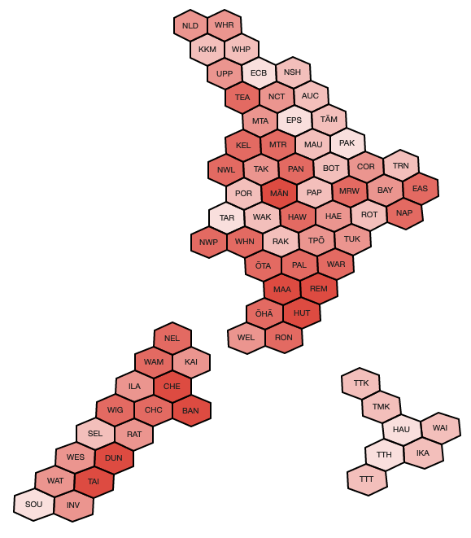
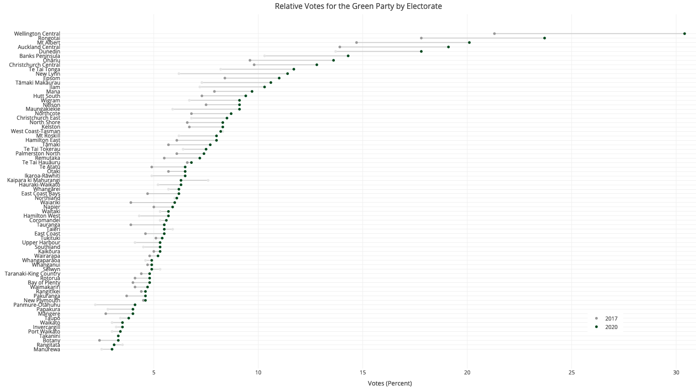
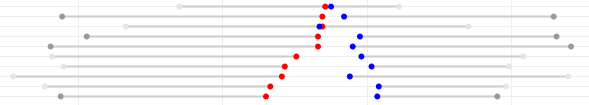

```{r init, include=FALSE}
knitr::opts_chunk$set(echo = FALSE)
knitr::opts_chunk$set(message = FALSE)
knitr::opts_chunk$set(warning = FALSE)
```

```{r setup, include=FALSE}
library(flexdashboard)
```

## 

### Welcome

We just had [an election](https://en.wikipedia.org/wiki/New_Zealand_general_election,_2020) in New Zealand. Yay!
I was going to sit this one out and enjoy everyone else's analysis, but there wasn't as much as I expected -
especially good maps. Luckily I spent some time [visualising the 2017 election](https://david.frigge.nz/election2017/)
and the code was relatively straightforward to adapt.

One large caveat is that around half of the electorates had boundary changes between 2017 and 2020, so
comparisons of voting changes may be due in part to different populations.
There's also a new electorate, which at least made the hexmaps more than simply re-running
code with new numbers.

Note that these pages are *desktop friendly*.
They don't "fail" as such on mobile, but if you really want to poke about in the
detail you'll fare better on a larger screen.

David Friggens, October/November 2020

### Hexmaps

<p>
<a href="hexmaps.html"></a>
<a href="hexmaps.html"></a>
</p>

Geographical maps of results don't give a good representation of the spread of support
various parties have. So here are some cartograms with one tile per electorate. You can
see candidate race winners and vote concentration for the main parties.


## 

### Dumbbells: Parties

<p>
<a href="dumbbells.html"></a>
<a href="dumbbells.html"></a>
</p>

We know which parties gained and lost votes since 2017, but the national number doesn't
tell the full story. Was there universal swing, or were there localised ups and
downs? These dumbbell plots help make it clear, both for individual parties and
the overall Left vs Right shift.

<p><a href="dumbbells.html"></a></p>


### Dumbbells: Referenda

How variable was the support for the two referenda on the ballot this year?
We'll find out when they release some results.


<script>
  (function(i,s,o,g,r,a,m){i['GoogleAnalyticsObject']=r;i[r]=i[r]||function(){
  (i[r].q=i[r].q||[]).push(arguments)},i[r].l=1*new Date();a=s.createElement(o),
  m=s.getElementsByTagName(o)[0];a.async=1;a.src=g;m.parentNode.insertBefore(a,m)
  })(window,document,'script','https://www.google-analytics.com/analytics.js','ga');

  ga('create', 'UA-30013353-2', 'auto');
  ga('send', 'pageview');

</script>

